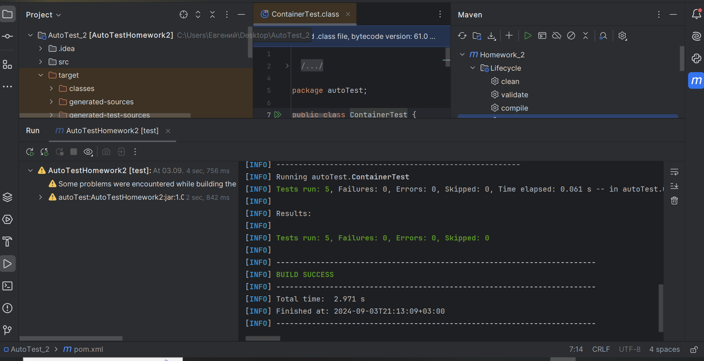
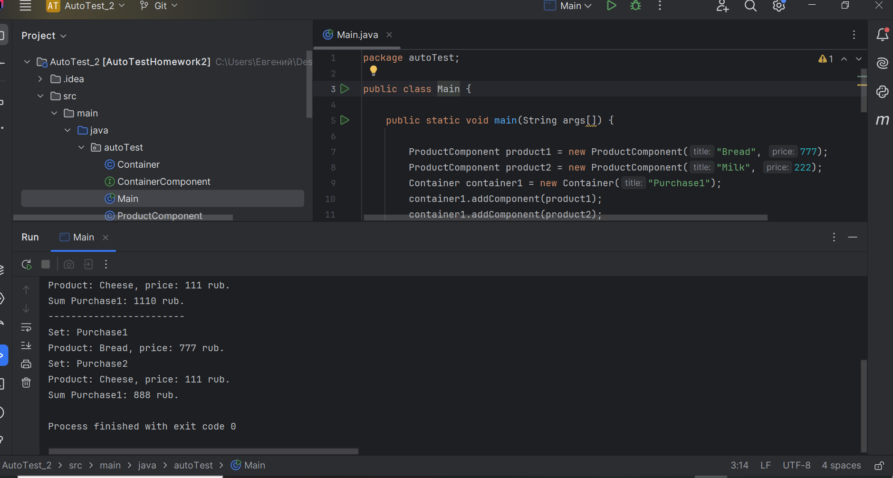

В качестве домашнего задания вы должны самостоятельно реализовать паттерн Компоновщик и покрыть его тестами.
Вам необходимо:

1. Создать свой Java Maven проект;
2. Добавить библиотеки JUnit;
3. Самостоятельно реализовать прикладную задачу;
4. Покрыть проект тестами;
5. Использовать абстрактные классы;
6. Использовать параметризованные тесты;
7. Использовать ЖЦ тестов;
8. Написать негативные тесты;
9. Запушить проект в GIT и прислать ссылку.

---

## Test-run проекта

## 

## Main-test

